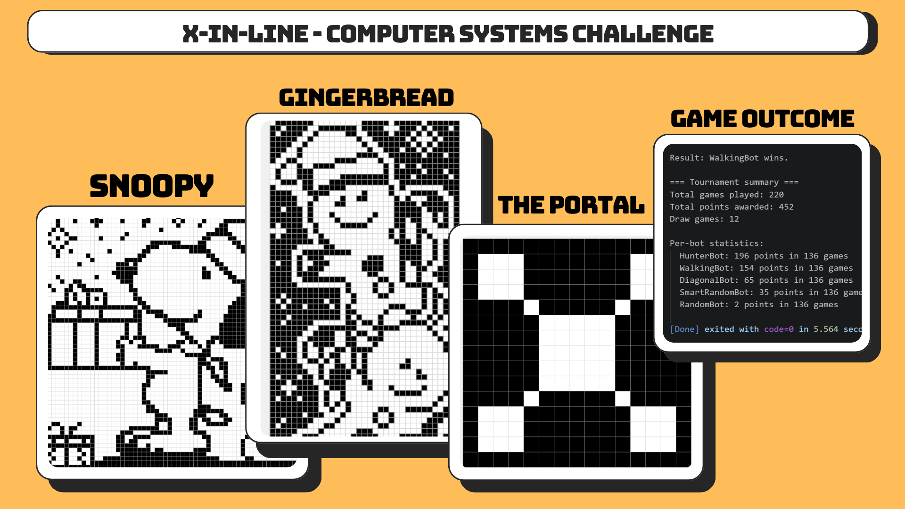

# X-in-Line: Computer Systems Challenge



X-in-Line is a Python bot tournament where every player tries to place enough marks in a row before the others do. Boards can change the grid size, obstacles, number of competitors, win length, and per-move time limit, so a strategy that wins one map may fail on the next.

The challenge was created for the final lecture of the Computer Systems course at the University of Southern Denmark. It is now an open, forkable challenge: create a bot, design a board, run a tournament, and open a pull request so the competition can keep evolving.

## The Challenge

Every bot receives the same board configuration and must choose legal moves under a time budget. The arbiter decides the winner. Good bots do more than chase their own lines: they recognise threats, block opponents, work around obstacles, and adapt to different board shapes.

Included boards range from familiar Tic-Tac-Toe and Gomoku to obstacle-heavy and portal-style maps. `HunterBot`, contributed by Manish Raj Moriche, focuses on nearby meaningful moves instead of scanning every square on the board.

## Quick Start

Requirements: Python 3.10+ with the standard library. No packages need to be installed.

```bash
git clone https://github.com/MRM-MB/X-IN-LINE.git
cd X-IN-LINE
python main.py
```

The runner automatically discovers all board modules in `boards/` and all bot classes in `bots/`. Tournament results are written to `logs/`, which is intentionally ignored by Git.

Optional runner arguments:

```bash
python main.py --verbose debug
python main.py --boards boards --bots bots --logs logs
```

## Add a Bot

1. Fork this repository and create a branch for your bot.
2. Add a Python module in `bots/`, for example `bots/my_bot.py`.
3. Create a class that inherits from `BaseBot`.
4. Run `python main.py` and improve your strategy.
5. Open a pull request with a short explanation of your approach.

```python
from bots.base_bot import BaseBot


class MyBot(BaseBot):
    def init_board(self, cols, rows, win_length, obstacles, time_given):
        self.cols = cols
        self.rows = rows

    def make_a_move(self, time_left):
        return (0, 0)

    def notify_move(self, bot_uid, move):
        pass
```

Your bot must return a legal `(x, y)` position from `make_a_move()`. See the existing bots for working strategy examples.

## Create a Board

Boards are plain Python modules in `boards/`. Every board must provide these constants:

```python
BOARD_NAME = "MyBoard"
BOARD_WIDTH = 10
BOARD_HEIGHT = 10
WIN_LENGTH = 4
NUM_PLAYERS = 2
OBSTACLES = [(2, 3), (5, 7)]
GAME_TIME_MS = 1000
```

Save your module as `boards/my_board.py`. The tournament runner discovers it automatically the next time you run `python main.py`.

### Visual Board Designer

The visual generator lives in [`tools/board_designer/`](tools/board_designer/). It lets you set the board dimensions, paint obstacles, and generate the Python configuration to paste into a new file in `boards/`.

```bash
python tools/board_designer/board_designer.py
```

The designer uses Tkinter, which is included with most standard Python installations.

## 👥 Contribute

Bots, boards, bug fixes, documentation improvements, and tournament ideas are welcome. Please read [CONTRIBUTING.md](CONTRIBUTING.md) before opening a pull request.

## Project Layout

```text
boards/                   Board definitions discovered at runtime
bots/                     Base class and bot strategies
game/                     Arbiter, discovery, and tournament runner
tools/board_designer/     Visual board generator and guide
contributions_Manish/     Original board notes and challenge contributions
assets/                   README media
logs/                     Local tournament output, ignored by Git
```

## License

Released under the [MIT License](LICENSE).
